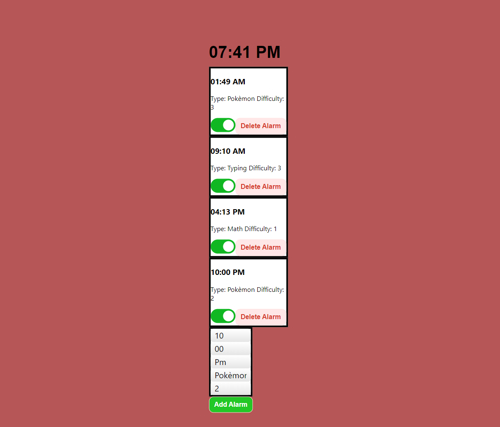
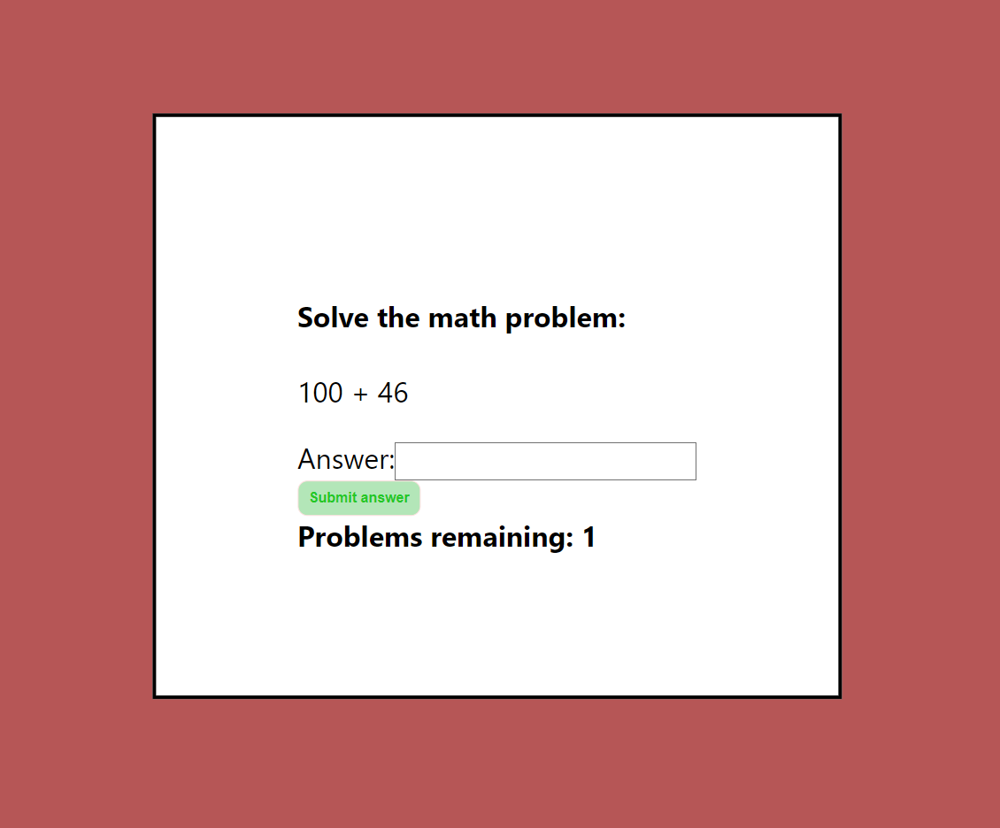
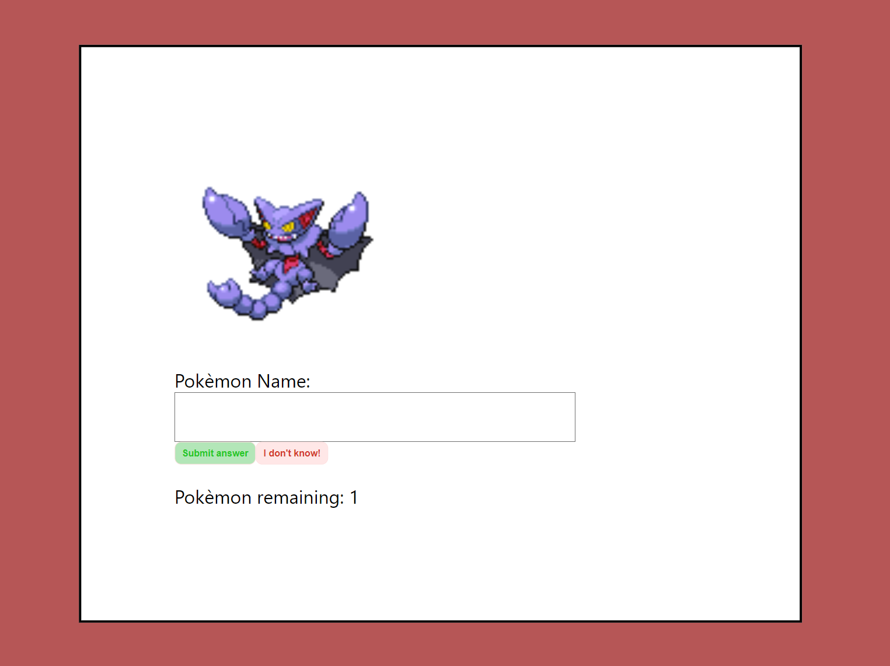
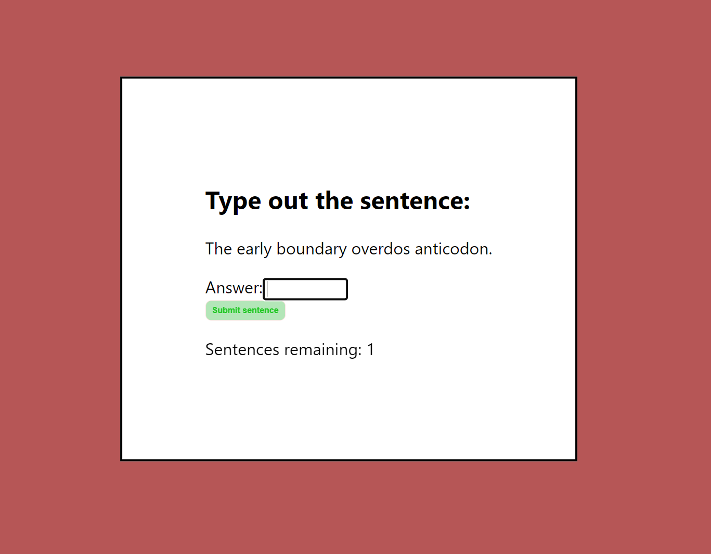

APIs I intend to use:
https://pokeapi.co/?ref=apilist.fun
I also intend to make a math api

This app is designed to help people who struggle to wake up to a standard alarm.
When setting an alarm, you have to set a certain type of problem to answer when it goes to make it stop.
The types of alarms include:
Math, Pokemon, and Typing

This is the math alarm type:
This uses a custom API I wrote in the backend

This is the Pokèmon alarm type:
This uses the PokeAPI to get the Pokèmon https://pokeapi.co/?ref=apilist.fun

This is the Typing alarm type:
This uses a custom API I wrote in the backend to get the sentences
